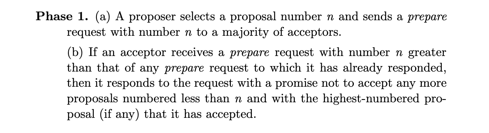
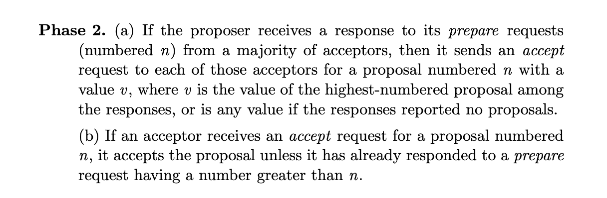
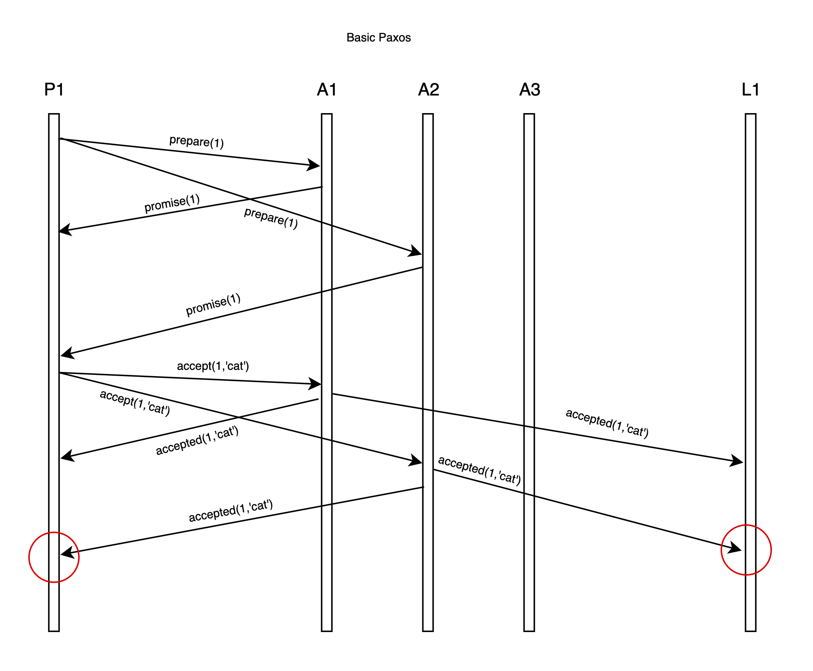
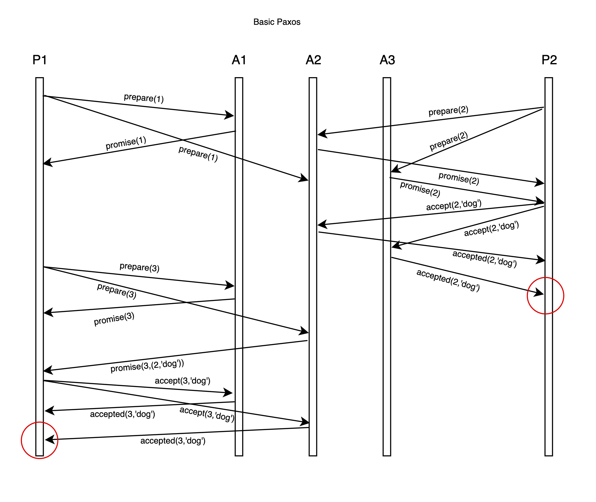
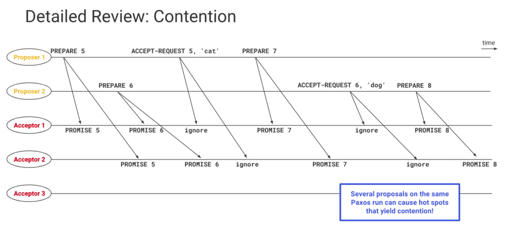
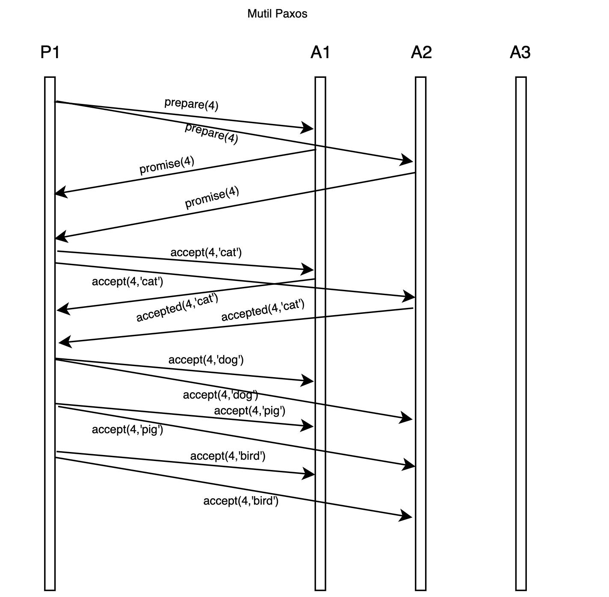

# Paxos For Studying

## 一、Paxos共识算法介绍

* Paxos算法是分布式系统中的一个共识算法家族

* Paxos( [The Part-Time Parliament](http://lamport.azurewebsites.net/pubs/lamport-paxos.pdf) )共识算法由Leslie Lamport首次在1990年发表在TOCS，后来由于大多数人不太能接受他的幽默风趣的介绍方法（其实用比喻的方式介绍长篇的理论，确实让人比较难理解），于是在2001年重新写一篇名叫 [Paxos Made Simple](http://lamport.azurewebsites.net/pubs/paxos-simple.pdf) 论文，相当于原始Paxos算法的简化版，这篇文章与原始文章在讲述Paxos算法上最大的不同就是用的都是计算机术语，看起来也轻松很多

* "世界上只有两种分布式共识算法，一种是Paxos算法，另一种是类Paxos算法"

* 现在比较流行的zab和raft算法也是基于Paxos算法设计的

## 二、Basic Paxos（基本的Paxos算法）

* **Basic Paxos 是在一轮决策中对一个或多个被提议(propose)的值，最终选出一个值达成共识**
 

* **Basic Paxos 可以解决的问题**
    1. 选主
    2. 资源互斥访问
    3. 复制日志的一致性
    4. 其它
 

* **容错模型**
    1. 异步网络，网络是不可靠的，消息可能丢失、重复、延迟、网络分区，但是不包括拜占庭错误，即消息不会被串改和伪造
    2. 只要majority服务器还运行，决议就能继续进行
 

* [FLP](https://groups.csail.mit.edu/tds/papers/Lynch/jacm85.pdf)**定理**
    1. Agreement：所有server必须对同一个值达成共识
    2. Validity：达成共识的值必须是提议的有效值
    3. Termination：最终会对一个值达成共识
 

* [Safety & Liveness](https://lrita.github.io/images/posts/distribution/safety-and-liveness-properties-a-survey.pdf)

    1. Safety（不会有坏事发生）:
    - 只有一个值达成共识
    - 一个server不会知道某个值达成共识，除非它真的已经达成共识

    2. Liveness（好事一定会发生）: 
    - 最终一定会达成共识（在多个proposer的情况下不能保证）
    - 如果共识达成最终所有服务器都能知道
 

* **Paxos 角色构成**

    1. Proposer
    - 处理客户端请求，主动发起提议
    2. Acceptor
    - 被动接收来自Proposer的提议消息，并返回投票结果，通知learner
    3. Learner
    - 被动接收来自Acceptor的消息
 

* **Paxos两阶段协议**

1. Phase1

2. Phase2

* **Paxos经典场景**

1. 单个Proposer发起提议情况

2. 多个Proposer情况

3. 死锁情况

## 三、Mutil-paxos

* 当需要决定多个值时就需要连续执行多次Paxos算法，一般执行一次Paxos算法的过程称作A Paxos run 或者 A Paxos instance，连续决定多个值则就需要执行多次Paxos run

* 为了避免死锁的情况，一般选举一个leader

* 两阶段协议效率太低，可以有优化的空间。在单个Leader的情况下，如果前一次已经accept成功，接下来不再需要prepare阶段，直接进行accept。

## 四、Implementing state machine

basic paxos -> mutil-paxos -> replicated state machine

## 五、Paxos算法go语言实现

## 六、参考

1. [The Part-Time Parliament](http://lamport.azurewebsites.net/pubs/lamport-paxos.pdf)

2. [Paxos Made Simple](http://lamport.azurewebsites.net/pubs/paxos-simple.pdf)

3. [FLP定理](https://groups.csail.mit.edu/tds/papers/Lynch/jacm85.pdf)

4. [Safety & Liveness](https://lrita.github.io/images/posts/distribution/safety-and-liveness-properties-a-survey.pdf)

5. [Understanding Paxos](https://www.cs.rutgers.edu/~pxk/417/notes/paxos.html)

6. [Google TechTalks About Paxos](https://www.youtube.com/watch?v=d7nAGI_NZPk)

7. [Paxos lecture (Raft user study)](https://www.youtube.com/watch?v=JEpsBg0AO6o)

